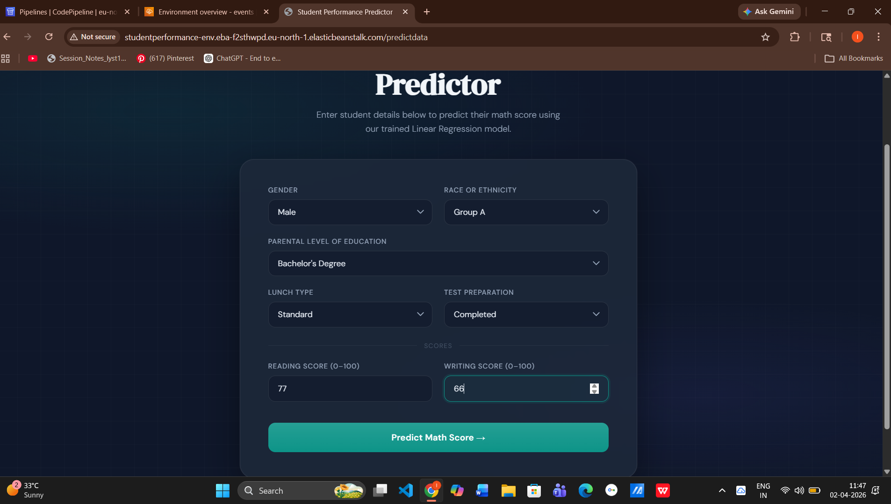
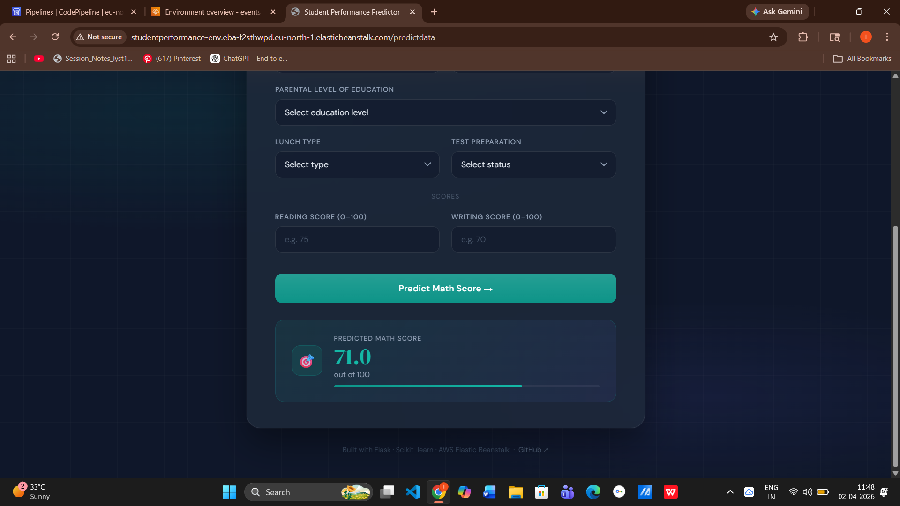

# 🎓 Student Performance Prediction — End to End Machine Learning Project

A production-ready machine learning web application that predicts a student's **math score** based on personal and academic background. Built with a modular ML pipeline, Flask web app, and deployed on **AWS Elastic Beanstalk** via **CI/CD with AWS CodePipeline**.

---

## 🔗 Live Demo

> http://studentperformance-env.eba-f2sthwpd.eu-north-1.elasticbeanstalk.com/predictdata

---

## 📸 Screenshots

### Prediction Form


### Prediction Result


---

## 📌 Problem Statement

Can we predict how well a student will perform in math based on factors like gender, parental education, lunch type, test preparation, and scores in other subjects?

This project builds an end-to-end ML system to answer that question — from raw data to a live web app.

---

## 📊 Dataset

- **Source**: [Students Performance in Exams — Kaggle](https://www.kaggle.com/datasets/spscientist/students-performance-in-exams)
- **Rows**: 1000 students
- **Target Variable**: `math_score`
- **Features**:

| Feature | Type | Description |
|---------|------|-------------|
| gender | Categorical | Male / Female |
| race/ethnicity | Categorical | Group A–E |
| parental level of education | Categorical | Education level of parent |
| lunch | Categorical | Standard / Free or reduced |
| test preparation course | Categorical | Completed / None |
| reading score | Numerical | Score out of 100 |
| writing score | Numerical | Score out of 100 |

---

## 🧠 ML Pipeline

```
Raw Data → EDA → Data Transformation → Model Training → Best Model → Prediction
```

### Models Trained & Compared

| Model | Result |
|-------|--------|
| Linear Regression | ✅ Best Model |
| Random Forest | Ensemble of decision trees |
| Gradient Boosting | Sequential boosting |
| XGBoost | Optimized gradient boosting |
| CatBoost | Gradient boosting for categorical data |
| AdaBoost | Adaptive boosting |
| Decision Tree | Single tree model |

---

## 📈 Model Performance

| Metric | Score |
|--------|-------|
| Best Model | **Linear Regression** |
| R² Score | **~0.88** |
| Evaluation | Tested on 20% held-out test set |

> Linear Regression outperformed all other models because math score, reading score, and writing score are highly linearly correlated.

---

## 📁 Project Structure

```
mlproject/
├── src/
│   ├── components/
│   │   ├── data_ingestion.py        # Load and split data
│   │   ├── data_transformation.py   # Feature engineering & preprocessing
│   │   └── model_trainer.py         # Train & evaluate 7 ML models
│   ├── pipeline/
│   │   ├── predict_pipeline.py      # Inference pipeline
│   │   └── train_pipeline.py        # Training pipeline
│   ├── notebook/data/
│   │   ├── 1. EDA STUDENT PERFORMANCE.ipynb   # Exploratory Data Analysis
│   │   └── 2. MODEL TRAINING.ipynb            # Model comparison & selection
│   ├── exception.py                 # Custom exception handler
│   ├── logger.py                    # Logging setup
│   └── utils.py                     # Helper functions
├── artifacts/
│   ├── model.pkl                    # Trained model (Linear Regression)
│   ├── preprocessor.pkl             # Fitted preprocessor
│   ├── train.csv                    # Training data
│   └── test.csv                     # Test data
├── templates/
│   ├── index.html                   # Home page
│   └── home.html                    # Prediction form page
├── assets/
│   ├── app_demo.png                 # App screenshot
│   └── app_result.png               # Result screenshot
├── application.py                   # Flask app entry point
├── Procfile                         # AWS EB process config
├── requirements.txt                 # Python dependencies
└── setup.py                         # Package setup
```

---

## ⚙️ Tech Stack

| Category | Technology |
|----------|-----------|
| Language | Python 3.11 |
| Best Model | Linear Regression (Scikit-learn) |
| Other Models | XGBoost, CatBoost, Random Forest, Gradient Boosting, AdaBoost, Decision Tree |
| Web Framework | Flask + Gunicorn |
| Data Processing | Pandas, NumPy |
| Deployment | AWS Elastic Beanstalk |
| CI/CD | AWS CodePipeline + GitHub |
| Version Control | Git + GitHub |

---

## 🚀 How to Run Locally

### 1. Clone the repository
```bash
git clone https://github.com/ishu2022/mlproject.git
cd mlproject
```

### 2. Create and activate virtual environment
```bash
python -m venv venv
venv\Scripts\activate        # Windows
source venv/bin/activate     # Mac/Linux
```

### 3. Install dependencies
```bash
pip install -r requirements.txt
```

### 4. Train the model
```bash
python -m src.components.data_ingestion
```

### 5. Run the Flask app
```bash
python application.py
```

Open your browser at: `http://localhost:5000/predictdata`

---

## 🌐 Deployment Architecture

```
GitHub → AWS CodePipeline → AWS Elastic Beanstalk (Python 3.11)
```

- **Source**: GitHub `main` branch triggers pipeline automatically
- **Platform**: Python 3.11 on 64-bit Amazon Linux 2023
- **Instance**: t3.small with 20GB storage
- **Server**: Nginx + Gunicorn
- **Region**: eu-north-1 (Stockholm)

---

## 🔮 Sample Prediction

**Input:**
- Gender: Male
- Race/Ethnicity: Group A
- Parental Education: Bachelor's Degree
- Lunch: Standard
- Test Preparation: Completed
- Reading Score: 77
- Writing Score: 66

**Predicted Math Score: 71.0**

---

## 📓 Notebooks

| Notebook | Description |
|----------|-------------|
| [EDA Notebook](src/notebook/data/1.%20EDA%20STUDENT%20PERFORMANCE%20.ipynb) | Data exploration, distributions, correlations |
| [Model Training](src/notebook/data/2.%20MODEL%20TRAINING.ipynb) | Model comparison, hyperparameter tuning, best model selection |

---

## 👨‍💻 Author

**Ishu** — [@ishu2022](https://github.com/ishu2022)

---

## 📄 License

This project is open source and available under the [MIT License](LICENSE).
